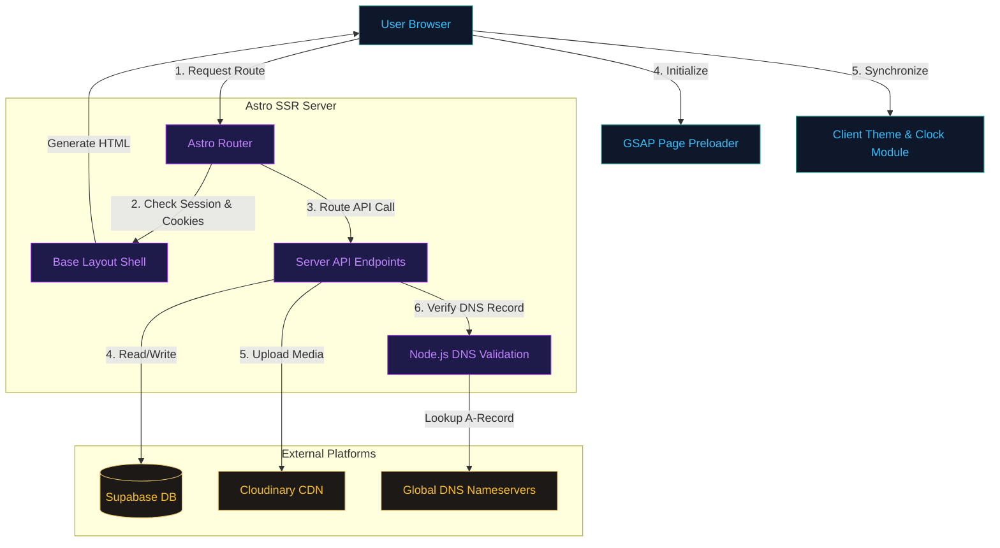

# KINBO TECHNOLOGIES PRIVATE LIMITED — Portolio & Enterprise Platform

An enterprise-grade portfolio and administrative management platform built for **KINBO TECHNOLOGIES PRIVATE LIMITED** and its founder, **Arjun Jayesh**. 

The platform is designed to scale dynamically, utilizing **Astro's Server-Side Rendering (SSR)** capabilities combined with **React/Preact Hydration Islands** for highly responsive and interactive client elements. It features a fully functional administration portal, dynamic configuration management, custom redirects with server-side DNS verification, and lead/collaboration tracking.

---

## 🏗️ Repository Construction & File Map

```text
portolio/
├── public/                       # Static public assets (icons, images, models collage)
├── src/
│   ├── components/               # Astro & React/Preact UI Components
│   │   ├── AdminInterface.tsx    # [Preact] Secure database, config, & redirect panel
│   │   ├── AutoCarousel.tsx      # [Preact] Dynamic infinite screenshot runner
│   │   ├── BlogFilter.tsx        # [Preact] Client-side category filtering for journal posts
│   │   ├── BlogSection.astro     # Server-side blog collection loader
│   │   ├── Breadcrumbs.astro     # Automated path navigation component
│   │   ├── Chat.astro            # Interactive developer-console styled contact form
│   │   ├── IdeasForm.tsx         # [Preact] Multi-step dynamic RFP estimator
│   │   ├── Socials.astro         # Social networking strip
│   │   └── Works.astro           # Selected works timeline animation container
│   ├── content/                  # Local MDX content files (Static blog fallback)
│   │   ├── blog/                 # MDX files (e.g., entropy-chaotic-loops.mdx)
│   │   └── config.ts             # Astro content collection schema definition
│   ├── data/                     # Local fallback datasets
│   │   ├── socials.ts            # Social handles & URL mapping
│   │   └── works.ts              # Fallback portfolio data catalog
│   ├── layouts/
│   │   └── Layout.astro          # Root layout shell with Global CSS, SEO headers, & Preloader
│   ├── lib/
│   │   └── supabase.ts           # Supabase client instantiation (Client/Admin instances)
│   ├── pages/                    # Dynamic Routing and API Endpoints
│   │   ├── api/                  # Server-Side API Handlers (SSR)
│   │   │   ├── blog.ts           # CRUD endpoints for posts
│   │   │   ├── config.ts         # GET/POST endpoints for site configurations
│   │   │   ├── ideas.ts          # POST/GET endpoints for collaboration ideas
│   │   │   ├── products.ts       # CRUD endpoints for dynamic product lists
│   │   │   ├── redirects.ts      # CRUD endpoints with A-Record DNS validation
│   │   │   └── upload.ts         # Cloudinary media endpoint
│   │   ├── products/
│   │   │   ├── index.astro       # Product catalog with Industry Models section
│   │   │   └── queuezero.astro   # Dedicated clinical infrastructure product showcase
│   │   ├── about.astro           # KINBO story and core philosophy page
│   │   ├── admin.astro           # Password-locked master control login page
│   │   ├── apply.astro           # Dynamic employee application intake form page
│   │   ├── blog.astro            # Journal overview entrypoint
│   │   ├── chat.astro            # Interactive console/terminal contact page
│   │   ├── founder.astro         # Arjun Jayesh portfolio, profile, & selected works timeline
│   │   ├── ideas.astro           # Dynamic RFP estimator intake page
│   │   ├── index.astro           # Home landing page with live statistics and video hero
│   │   ├── socials.astro         # Structured link-in-bio index
│   │   └── team.astro            # Dynamically editable team directory page
│   └── styles/
│       └── global.css            # Root Tailwind imports and design tokens
├── .env                          # Local environment variables
├── astro.config.mjs              # Astro build and routing configuration (Node adapter enabled)
├── package.json                  # Dependencies manifest
├── supabase_enterprise.sql       # Database schema upgrades for enterprise assets
├── supabase_ideas.sql            # Lead and Idea generation schema
├── supabase_products.sql         # Dynamic product details schema
├── supabase_redirects.sql        # Dynamic domains mapping schema
├── verify_api.js                 # API testing script (CommonJS)
└── verify_api.mjs                # Advanced API testing script (ES Module)
```

---

## ⚡ Tech Stack & Architecture



### 1. Hybrid Server-Side Rendering (SSR)
The application runs with `output: 'server'` enabled via the `@astrojs/node` adapter. This allows:
* **Real-time configuration**: The home page, blog, and products dynamically compile with database records on every request, completely eliminating the need for rebuilds when content updates.
* **Master Key Authorization**: Safe administrative login processing using secure, HTTP-only authentication cookies (`admin_session`) configured server-side.
* **Secure API Integration**: Server-only environment variables (like `SUPABASE_SERVICE_ROLE_KEY`) are kept isolated from client bundles.

### 2. Hydration Islands (React/Preact)
Astro compiles components as static HTML by default. However, core interactive modules run on Preact to maintain a light execution payload:
* `<AdminInterface client:only="preact" />`: Direct database CRUD control panel.
* `<IdeasForm client:load />`: Multi-step questionnaire with cost calculations and local state storage.
* `<WorksFilter client:load />` & `<BlogFilter client:load />`: Instant category filtering utilizing local state memory.
* `<AutoCarousel client:load />`: Interactive, infinite hardware and software layout slideshow.

### 3. High-Fidelity Design System
The user interface implements standard professional dark-mode design tokens tailored using Tailwind CSS:
* **Typography**: Clean, readable typography pairing `Outfit`, `Inter`, and `Lora` via Google Fonts.
* **Micro-Animations**: GSAP (GreenSock Animation Platform) + ScrollTrigger for scroll-based fades and slide-in offsets on `.product-block`, `.about-section`, and `.timeline-item`.
* **Utility Ribbon**: Global header bar displaying current local systems time (synchronizing GMT/local time offsets) and theme modes.

---

## 🗄️ Database Schema & Storage Definitions

The platform utilizes Supabase (PostgreSQL) for state management. Below are the structural definitions of the database tables:

### 1. `site_config`
Stores the dynamic attributes used to change visual elements of the application.
```sql
CREATE TABLE site_config (
    id SERIAL PRIMARY KEY,
    key TEXT UNIQUE NOT NULL,
    data JSONB NOT NULL,
    updated_at TIMESTAMPTZ DEFAULT NOW()
);
```
**Used keys:**
* `enterprise_assets`: Configures the website header logo, favicon, locations, founder's photo, and WhatsApp Floating Widget properties (`whatsapp_number`, `whatsapp_message`).
* `primary_settings`: Homepage configurations containing the dynamic bio details, hero video layout properties, and performance stats.
* `models_section`: Controls headings, descriptions, and background collage URLs on the standard industry frameworks section.
* `team_assets`: Dynamic configuration for the `/team` directory heading, description text, and members list.

### 2. `products`
Holds products offered by the enterprise (e.g., Glowup, Relic).
```sql
CREATE TABLE products (
    id BIGSERIAL PRIMARY KEY,
    name TEXT NOT NULL,
    tagline TEXT,
    description TEXT NOT NULL,
    features TEXT,
    category TEXT,
    status TEXT DEFAULT 'active',
    sort_order INT DEFAULT 0,
    logo_url TEXT,
    screenshots TEXT[],
    app_store_link TEXT,
    play_store_link TEXT,
    created_at TIMESTAMPTZ DEFAULT NOW(),
    updated_at TIMESTAMPTZ DEFAULT NOW()
);
```

### 3. `posts`
Dynamic articles visible within the enterprise journal section.
```sql
CREATE TABLE posts (
    slug TEXT PRIMARY KEY,
    title TEXT NOT NULL,
    category TEXT NOT NULL CHECK (category IN ('Software', 'Research', 'Automation')),
    date DATE NOT NULL,
    excerpt TEXT NOT NULL,
    body TEXT NOT NULL,
    updated_at TIMESTAMPTZ DEFAULT NOW()
);
```

### 4. `ideas`
Dynamic estimator intakes captured from potential collaborators.
```sql
CREATE TABLE ideas (
    id BIGSERIAL PRIMARY KEY,
    name TEXT NOT NULL,
    email TEXT NOT NULL,
    phone TEXT,
    project_type TEXT NOT NULL,
    budget TEXT,
    timeline TEXT,
    idea_title TEXT NOT NULL,
    idea_description TEXT NOT NULL,
    target_audience TEXT,
    features TEXT,
    portfolio_url TEXT,
    linkedin TEXT,
    additional_notes TEXT,
    status TEXT DEFAULT 'new',
    created_at TIMESTAMPTZ DEFAULT NOW(),
    updated_at TIMESTAMPTZ DEFAULT NOW()
);
```

### 5. `redirects`
Dynamic hostname forwarding registry.
```sql
CREATE TABLE redirects (
    id UUID PRIMARY KEY DEFAULT gen_random_uuid(),
    fqdn TEXT NOT NULL UNIQUE,
    target_url TEXT NOT NULL,
    created_at TIMESTAMP WITH TIME ZONE DEFAULT NOW(),
    updated_at TIMESTAMP WITH TIME ZONE DEFAULT NOW()
);
CREATE INDEX idx_redirects_fqdn ON redirects(fqdn);
```

### 6. `industry_models`
Framework models displaying vertical-specific standards on the products catalog page.
```sql
CREATE TABLE industry_models (
    id BIGSERIAL PRIMARY KEY,
    title TEXT NOT NULL,
    description TEXT NOT NULL,
    category TEXT NOT NULL,
    icon_type TEXT DEFAULT 'generic',
    is_featured BOOLEAN DEFAULT FALSE,
    benchmark_name TEXT,
    benchmark_url TEXT,
    sort_order INT DEFAULT 0,
    created_at TIMESTAMPTZ DEFAULT NOW()
);
```

### 7. `service_leads`
Stores lead information captured from custom contact forms, services forms, and employee applications.
```sql
CREATE TABLE service_leads (
    id UUID PRIMARY KEY DEFAULT gen_random_uuid(),
    form_type TEXT NOT NULL, -- e.g., 'research_mentorship', 'workshop_booking', 'Employee Application'
    name TEXT NOT NULL,
    email TEXT NOT NULL,
    phone TEXT,
    organization TEXT,
    metadata JSONB,
    status TEXT DEFAULT 'new',
    created_at TIMESTAMPTZ DEFAULT NOW(),
    updated_at TIMESTAMPTZ DEFAULT NOW()
);
CREATE INDEX idx_service_leads_form_type ON service_leads(form_type);
```

### 8. `payments`
Stores Razorpay transaction records for user payments.
```sql
CREATE TABLE payments (
    id UUID PRIMARY KEY DEFAULT gen_random_uuid(),
    razorpay_order_id TEXT NOT NULL,
    razorpay_payment_id TEXT UNIQUE,
    razorpay_signature TEXT,
    amount INTEGER NOT NULL,
    currency TEXT DEFAULT 'INR',
    service_name TEXT NOT NULL,
    customer_name TEXT,
    customer_email TEXT,
    customer_phone TEXT,
    customer_org TEXT,
    status TEXT DEFAULT 'created',
    verified BOOLEAN DEFAULT FALSE,
    metadata JSONB,
    created_at TIMESTAMPTZ DEFAULT NOW(),
    updated_at TIMESTAMPTZ DEFAULT NOW()
);
```

---

## 🔄 Dynamic Flows

### 1. User RFP Form Submission Flow
1. User interacts with `<IdeasForm />`, fill steps, and triggers submissions.
2. Form validates fields locally and sends a `POST` request containing payload details to `/api/ideas`.
3. `/api/ideas` uses `supabaseClient` to execute insert into table `ideas`.
4. If insert completes successfully, a transaction confirmation signal returns to Preact, showing the user the Success card.

### 2. Admin Media Upload & Config Save Flow
1. An administrator authenticates using the Master Key.
2. In `<AdminInterface />`, the admin selects an asset image and drops it in the uploader.
3. The client calls `/api/upload` (multipart form).
4. `/api/upload` maps the asset and initiates a server-to-server request targeting Cloudinary:
   ```text
   POST https://api.cloudinary.com/v1_1/dw4fmucml/image/upload
   ```
5. Cloudinary processes and responds with a secure URL mapping.
6. The API relays the URL back to `<AdminInterface />`, which stores the value in `site_config` via the `/api/config` POST endpoint.

### 3. Dynamic DNS-Validated Redirection Flow
1. The admin registers a domain redirect mapping in the Admin Panel (e.g., forwarding `docs.kinbo.tech` to `https://notion.so/...`).
2. Before registering, the `/api/redirects` POST handler runs a dynamic server DNS lookup:
   ```typescript
   resolvedIps = await dns.resolve4(fqdn);
   ```
3. The system confirms if the A Record resolves to the expected proxy IP address (`18.133.72.105`).
4. If validation fails, it queries `dns.resolveAny(fqdn)` to compile detailed diagnostics, returning a `422 Unprocessable Entity` with logs.
5. If verified, the redirect is upserted to the `redirects` table.

---

## 🛠️ Local Development & Operations

### 1. Prerequisites
Ensure you have `Node.js (v18.x or v20.x)` installed.

### 2. Environment Configuration
Create a `.env` file in the root directory:
```env
PUBLIC_SUPABASE_URL=https://<project-ref>.supabase.co
PUBLIC_SUPABASE_ANON_KEY=your-anon-public-key
SUPABASE_SERVICE_ROLE_KEY=your-secret-service-role-key
ADMIN_PASSWORD=local
SITE=http://localhost:4321
ASTRO_TELEMETRY_DISABLED=1
HOST=0.0.0.0
PORT=4321
```

### 3. Running Local Environment
Install project dependencies and start the development server:
```sh
npm install
npm run dev
```
The application will launch on `http://localhost:4321`.

### 4. Running Backend Testing Scripts
You can verify endpoints locally using the provided API verification scripts:
```sh
# Verifies GET/POST /api/ideas, and GET /api/config using fetch APIs
node verify_api.mjs
```

---

## 🚀 Build & Deployment Guidelines

### 1. Building Production Bundle
To compile a production build of the Astro application:
```sh
npm run build
```
This generates assets optimized for standalone server runs inside the `.astro` output configuration.

### 2. Production Deployment (Standalone Node)
Start the built server instance in your host environment:
```sh
node ./dist/server/entry.mjs
```
The server will bind to the specified configuration values declared in the `HOST` and `PORT` environment parameters.
